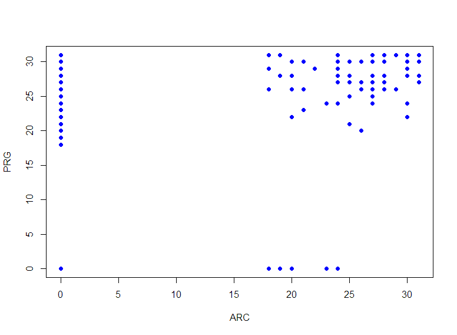
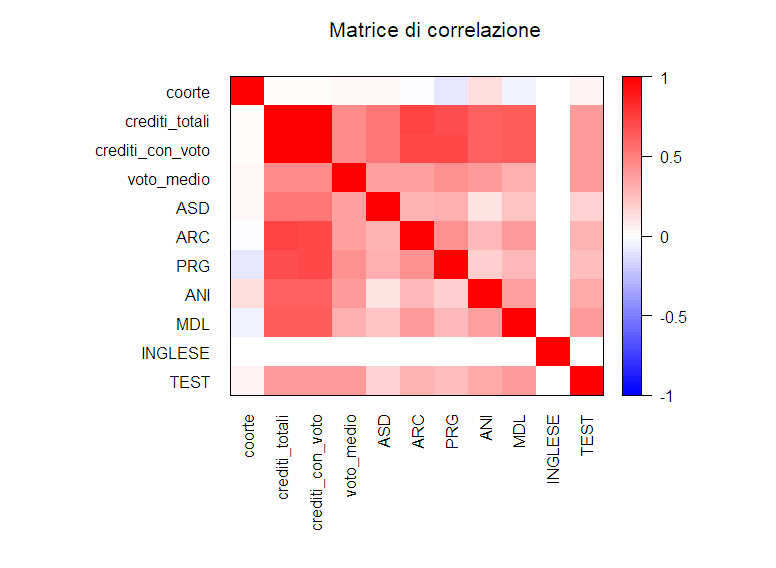
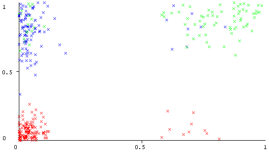

# Analisi carriere studenti iscritti al I anno del corso di laurea in Informatica

Analisi delle carriere degli studenti utilizzando il software Weka per eseguire l'algoritmo kmeans sui dati.

Scatterplot di Programmazione e Architetture:

___
Matrice di correlazione:

___
Cluster di Architetture e Programmazione

Plot sse
df <- read.table("/home/mameli/git/custeringStudentiInformatica/creditiSse.csv", 
+                  header = FALSE)

plot(df)
> lines(df, type = "o", col = "blue", lwd="5")

Import clustered
library(readr)
crediti_totali_prg_arc_clustered <- read_csv("git/clusteringStudentiInformatica/crediti_totali-prg-arc-clustered.csv", 
    col_types = cols(ANI = col_skip(), ASD = col_skip(), 
        INGLESE = col_skip(), Instance_number = col_skip(), 
        MDL = col_skip(), TEST = col_skip(), 
        coorte = col_skip(), crediti_con_voto = col_skip(), 
        data_ANI = col_skip(), data_ARC = col_skip(), 
        data_ASD = col_skip(), data_INGLESE = col_skip(), 
        data_MDL = col_skip(), data_PRG = col_skip(), 
        voto_medio = col_skip()))
View(crediti_totali_prg_arc_clustered)

Matrice di incidenza
C = matrix(nrow = 316,ncol = 316)
for(i in 1:316){
    for(j in 1:316){
        if(crediti_totali_programmazione_architetture_clustered[i,4]==crediti_totali_programmazione_architetture_clustered[j,4]){
            C[i,j] = 1
        }else{
            C[i,j] = 0
        }
    }
}
matrice distanza
D = as.matrix(dist(crediti_totali_prg_arc_clustered[,1:3],method = 'euclidean',diag = TRUE,upper = TRUE))

c = as.vector(t(C))
d = as.vector(t(D))

cor(c,d,method="pearson")

Voto medio e test correlazione
-0.4755988 k=2
-0.4652048 k=3
-0.2730982 k=43

k NN per DBSCAN

D = as.matrix(dist(asd_arc_prg_an1_mdl_clustered[,1:ncol(asd_arc_prg_an1_mdl_clustered)-1],method = 'euclidean',diag = TRUE,upper = TRUE))
library(ggplot2)
D_1 = D
for(i in 1:nrow(asd_arc_prg_an1_mdl_clustered)){
    D_1[i,] = sort(D[i,])
}
p = 1:nrow(asd_arc_prg_an1_mdl_clustered)
dist = sort(D_1[,6])                                    #cambia 6 con k
data = data.frame(p,dist)
ggplot(data, aes(x=p, y=dist)) +    geom_point(shape=1) +  geom_line() + geom_point(color = 'black')